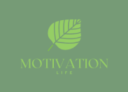

<h2 align="center">🌿Motivation🌿</h2>
<h1 align="center">

</h1>

#### 🔗 Tecnologia utilizada para o projeto:
Dart, Firebase (ainda não construído)

## 📌 About
Essa é um projeto criado para inserir os conhecimentos adquiridos dentro de sala de aula e também o projeto que foi desenvolvido com o objetivo de adquirir conhecimento em Dart. Ele é um aplicativo que envia mensagens motivacionais para o dia-a-dia de quem baixar o programa.

## Bibliotecas
flutter pub add intl

## Cores usadas:
teal, green, tealAccent, Color(4289909129)(4281683477),

### Cores utilizadas durante o projeto até o momento...
novo_projeto/lib/theme.dart

## Imagens:
1. Tela de Cadastro 

2. Tela de 'Esqueci a senha'

3. Tela de 'Home'

4. Tela de 'Timeline'

5. Menu Lateral 

6. Vídeo funcionando: 

Dentro da pasta lib 